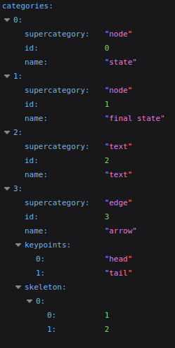

# Progetto rita

[Scrivo in italiano per fare prima, poi cambiamo in inglese]

[Progetto rita nome provvisorio, ben accette proposte]


Nomi papabili con cui rinominare repo e progetto:

- Diagramify
- Draw2Diagram


## Buone abitudini per non smadonnare

[Se avete altri suggerimenti per questa sezione ditelo, almeno evitiamo un cacatone di progetto]

- Attenersi allo standard dei linguaggi utilizzati
- Inserire sempre i **link delle fonti** (per la presentazione finale)
- Tener traccia di ciò che si fa con **file readme** o simili (markdown possibilmente, almeno si possono leggere da Github)
- **Commit in inglese**
- **Commenti (nel codice) in inglese**, esclusi TODO
- Nomi dei file, quando possibile, separati da underscore `_`

La documentazione possiamo tenerla in italiano, poi la facciamo tradurre a Chat


## Overview idea

**Goal**: Ottenere una rappresentazione digitale di un diagramma scritto a mano.

Il sistema si compone di diverse parti:

- **Preprocessor** (no rete): preprocessa le immagini, e.g. raddrizza le immagini (*geometria*)
- **Classifier** (rete): classifica i diagrammi restituendo la tipologia (e.g. `graph-diagram`, `flow-chart`)
- **Extractor** (ibrido): entità astratta per *estrarre* una rappresentazione agnostica di *una specifica tipologia* di diagramma da un'immagine (e.g. matrice del grafo per i `graph-diagram`)
- **Transducer** (no rete): traduce (staticamente) i concetti agnostici in uno *specifico* linguaggio di markup di rappresentazione dei diagrammi (e.g. Mermaid)
- **Compiler** (no rete): compila il linguaggio di markup nell'effettivo diagramma
- **Orchestrator** (no rete): gestisce il flusso e i componenti

> [!IMPORTANT]
> *Perché non una rete (e.g. transformer) che produce subito il linguaggio di markup?* Non abbiamo i dataset e potrebbe produrre linguaggio non funzionante.


La rete classificatrice è utilizzata per individuare quale modulo estrattivo utilizzare.

Ogni extractor è **specializzato** su una sola tipologia di digramma.

Per esempio, dato come input un'immagine di un grafo:


Il classificatore produce `graph-diagram`, dunque l'orchestratore porta all'extractor per i diagrammi l'immagine di input.

L'extractor dei diagrammi produce la matrice del grafo, dove per righe e per colonne si hanno i **nodi** e i **fuori nodi** (per gestire frecce che partono dal nulla). Il valore è un interno non negativo che indica il numero di connessioni (la posizione nella matrice indica provenienza e destinazione). Inoltre, produce le datastruct di lookup per notazioni sulle frecce e testo dei nodi.

L'orchestratore porta in input dei trasduttori (in base input dell'utente oppure tutti) della relativa tipologia di diagramma, i quali produrranno le traduzioni in linguaggio di lookup.
Per esempio, in Mermaid si potrebbe avere del testo del tipo:

```
graph LR;
    q0--> q0 & q1
    q1--> q2
    q2--> q2 & q1
"""
```

Infine, il linguaggio di markup è compilato con il relativo compilatore.


## System structure

[Non è presente il path perché in caso di refactor so che ci dimenticheremmo di fare refactor anche di questa parte, usate il finder per cercare le classi quando non chiare] 

### Components

#### Diagram

I diagram ID sono sempre di tipo `str` per una maggiore flessibilità, gli ID "well-known" sono listati nell'enum: `Diagram`

Usare `Diagram.DIAGRAM_TYPE.value` per ottenere l'ID stringa.

#### Classifier

`Classifier` classe astratta che rappresenta il componente classificatore.

Il metodo `classify` prende in input un oggetto `Image` e restituisce il digram ID.

##### Image

`Image` classe che wrappa l'immagine di input.

TODO: definire gli attributi interni, probabilmente un tensore `content` con i pixel o qualcosa del genere


#### Representation

`DiagramRepresentation` classe astratta generale per le rappresentazioni dei diagrammi.

Nella pratica viene usata la classe _concreta_ `UnifiedDiagramRepresentation` per la rappresentazione degli elementi del diagramma.

TODO: definire gli attributi interni, probabilmente un tensore `content` o qualcosa del genere


#### Transducer

`Transducer` classe astratta da ereditare per costruire i propri trasduttori.

Ogni trasduttore, by default, supporta solo `UnifiedDiagramRepresentation`.

L'id del trasduttore è usato per configurazioni avanzate dell'orchestratore, ad esempio quando si vuole ottenere 
solo un sotto-insieme dei possibili outcome.

Per creare un nuovo trasduttore bisogna implementare due metodi:

- `compatible_diagrams` che restituisce la lista di diagram ID gestibili (usato dall'orchestratore per capire cosa può essere passato al transducer)
- `elaborate` prende come input il diagram ID e la rappresentazione agnostica del diagramma; restituisce come output un `Outcome`


##### Outcome

`Outcome` classe wrapper per l'output finale di un trasduttore. L'orchestratore lo userà per ottenere il diagramma digitale (tramite compilatore).

Attualmente `Outcome` ha un solo attributo, i.e. `body`, predisposto a contenere ciò che dovrà essere passato al compilatore.

Per esempio in un transducer Mermaid:

```python
outcome.body = """
graph LR;
    A--> B & C & D
    B--> A & E
    C--> A & E
    D--> A & E
    E--> B & C & D
"""
```


#### Extractor

`Extractor` classe astratta da implementare in base al proprio estrattore.

Il metodo astratto `extract` necessita del tipo di diagramma (diagram ID) e l'immagine di input. 
Restituisce la `DiagramRepresentation` del diagramma (la quale verrà poi passata ai trasduttori compatibili).

Inoltre, è necessario specificare i diagram ID supportati, implementando il relativo metodo.

L'id dell'extractor è usato per configurazioni avanzate dell'orchestratore, ad esempio quando si hanno più estrattori 
e si vuole esplicitamente usarne solo un sotto-insieme.

## Dataset

Source: https://github.com/bernhardschaefer/handwritten-diagram-datasets

Ci sono tre cartelle:

- **source**: contiene i dataset presi da Internet
- **classifier**: contiene il dataset finale da usare per allenare il classificatore
- **extractor**: contiene le sotto-cartelle per le varie sotto-reti

### Graph diagram: dataset/source/fa

[dataset/source/fa](dataset/source/fa/) contiene solo **graph diagram**

Link dataset: https://cmp.felk.cvut.cz/~breslmar/finite_automata/

Ci sono 300 diagrammi disegnati da 25 persone.

I diagrammi sono tutti **annotati** con **bounding box**, *anche per il testo*.

*Categorie:*



*Esempio di annotazione*


## Possibili linguaggi di markup

- PlantUML
- Mermaid
- D2lang

Tool interessante: **kroki** (https://kroki.io/) 

> Kroki provides a unified API to create diagrams from textual descriptions
