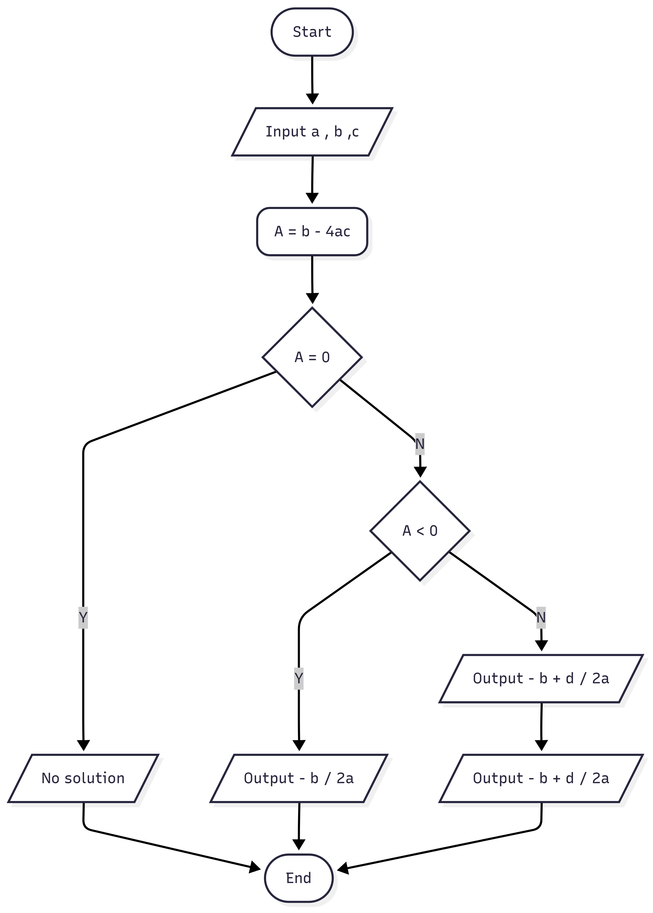

# D.I.A.G.R.A.M.: Development of Image Analysis for Graph Recognition And Modeling

This project proposes the development of a system for analyzing different types of handwritten diagrams and converting them into well-rendered images through a textual syntax.
The goal is to create a tool capable of analyzing scanned or photographed sketches of diagrams and automatically generating code that can be rendered into the same diagrams digitally, 
to eventually integrate or modify them.


## Get Started

### Install

#### Docker version

```bash
docker build -t diagram .
```


#### Install on host machine

1. Install **D2 CLI** from official repository: [https://github.com/terrastruct/d2](https://github.com/terrastruct/d2)
    - Linux: https://d2lang.com/tour/install/
    - [All releases](https://github.com/terrastruct/d2/releases)


Try `d2` installation.

```bash
d2 --version
```

2. Install dependencies (use Conda if you want)

```bash
pip3 install torch opencv-python matplotlib requests pillow pandas torchvision numpy shapely transformers sentencepiece protobuf torchmetrics scikit-learn
```

3. Check _DIAGRAM_ installation

```bash
python src/main.py -h
```

### Example

#### Docker

On Linux or Windows Powershell, use `pwd` (i.e. current directory) to mount a volume on `/app` project directory in Docker container.
Suppose to have images and weights in `demo` directory. 

```bash
docker run --rm -v "`pwd`/demo:/app/demo" diagram --input demo/demo_image1.png --classifier demo/classifier_weights.pth --bbox-detector demo/object_detector_weights.pth --outputs-dir-path demo/outcome --then-compile --element_arrow_distance_threshold 260
```


#### Local version

CLI options can be visualized thanks to flag: `-h`

CLI is in `src/main.py`

```bash
python src/main.py -h
```

CLI parameters are:

- `--input path/to/image1.png path/to/image2.png ...` provides input images (even more than one)
- `--classifier path/to/classifier_weights.pth` weights of classifier network
- `--bbox-detector path/to/object_detector_weights.pth` weights of object detection network
- `--outputs-dir-path path/to/output_dir` directory in which outputs will be dumped
- `--then-compile` flag to compile markup language file into images
- `--markups d2-lang mermaid` to specify markup languages

We advise you to tune thresholds based on your drawing style. We have tuned thresholds for common diagrams.

For example:

- `--element_arrow_distance_threshold 260`


### Demo

#### Graph

##### Easy Graph

```bash
--input demo/easy_graph.png --classifier demo/classifier_weights.pth --bbox-detector demo/object_detector_weights.pth --outputs-dir-path demo/outcome --then-compile --element_arrow_distance_threshold 150
```


##### Hard Graph

```bash
--input test/hard_graph.png --classifier demo/classifier_weights.pth --bbox-detector demo/object_detector_weights.pth --outputs-dir-path demo/outcome --then-compile --element_arrow_distance_threshold 250
```

> [!WARNING]
> An extra node will be found, because a self arrow is recognized as a node. Anyway, you can remove it from `.d2` markup file.
> 
> Non-Maximum Suppression is useless because _"Node"_ label has a greater score respects to _"Arrow"_ label.


#### Flowchart

##### Easy Flowchart

```bash
--input demo/easy_graph.png --classifier demo/classifier_weights.pth --bbox-detector demo/object_detector_weights.pth --outputs-dir-path demo/outcome --then-compile --element_arrow_distance_threshold 150
```


##### Hard Flowchart

```bash
--input test/hard_graph.png --classifier demo/classifier_weights.pth --bbox-detector demo/object_detector_weights.pth --outputs-dir-path demo/outcome --then-compile --element_arrow_distance_threshold 350
```





## Project Overview

System's components:

- **Preprocessor**: pre-elaborates images, e.g. straighten images
- **Classifier**: classifies input images (e.g. `graph-diagram`, `flowchart`)
- **Extractor**: extracts and builds agnostic representation of input diagram
- **Transducer**: converts agnostic representation of a diagram into a specific markup language (e.g. Mermaid)
- **Compiler**: produces an input from a markup language file
- **Orchestrator**: manages other components 


The classifier network is used to determine which extraction module to use.

Each extractor is specialized for a single type of diagram.

For example, given an input image of a graph:


The classifier outputs `graph-diagram`, so the orchestrator forwards the input image to the graph diagram extractor.

The graph diagram extractor produces the graph's adjacency matrix, where the nodes and external nodes (to handle arrows starting from nowhere) are represented in the rows and columns. The value is a non-negative integer indicating the number of connections (the matrix position indicates the source and destination). Additionally, it generates lookup data structures for arrow annotations and node text.

The orchestrator then sends this to the corresponding transducers (based on user input or all available ones) for that type of diagram, which will generate the translations into the target lookup language.
For example, in Mermaid, the output might be something like:

```
flowchart TD
	0(Y = X
	X =T)
	1{X > Y}
	2(T = Y)
	3(( ))
	4(( ))

	1-->|Else|4
	3-->1
	2-->0
	0-->4
	1-->|Then|2

```

Then, markup language is compiled using associated compiler.


## Dataset

Source: https://github.com/bernhardschaefer/handwritten-diagram-datasets


### Graph diagram: dataset/source/fa

We used the following datasets:
- https://cmp.felk.cvut.cz/~breslmar/finite_automata/ (**graph diagrams** only, fa)
- https://cmp.felk.cvut.cz/~breslmar/flowcharts/ (**flowchart diagrams**, fcb)
- https://tc11.cvc.uab.es/datasets/OHFCD_1 (**flowchart diagrams**, fca)
- https://github.com/dwslab/hdBPMN (**BPMN diagrams**, hdBPMN)
- https://www.kaggle.com/datasets/leticiapiucco/handwritten-uml-class-diagrams (**class diagrams**)
- https://github.com/aaanthonyyy/CircuitNet (**circuit diagrams**)
- https://paperswithcode.com/dataset/ai2d (**school diagrams**)

For the classifier, we used the class, circuit and school diagrams to gain more robustness

For the extractor, we used only flowchart and graph diagrams

The diagrams are all **annotated** with **bounding box**, *also for the text*
- in addition to the provided bounding boxes for the arrows we added the bounding boxes for the head(s) and tail(s)
  - we assumed an arrow can have two heads, two tails, or one head and one tail

*Categories*


*Annotation example*


