# D.I.A.G.R.A.M.: Development of Image Analysis for Graph Recognition And Modeling

This project proposes the development of a system for analyzing different types of handwritten diagrams and converting them into well-rendered images through a textual syntax.
The goal is to create a tool capable of analyzing scanned or photographed sketches of diagrams and automatically generating code that can be rendered into the same diagrams digitally, 
to eventually integrate or modify them.


## Get Started

### Install

#### Docker version

```bash
docker build -t diagram .
```


#### Install on host machine

1. Install **D2 CLI** from official repository: [https://github.com/terrastruct/d2](https://github.com/terrastruct/d2)
    - Linux: https://d2lang.com/tour/install/
    - [All releases](https://github.com/terrastruct/d2/releases)


Try `d2` installation.

```bash
d2 --version
```

2. Install dependencies (use Conda if you want)

```bash
pip3 install torch opencv-python matplotlib requests pillow pandas torchvision numpy shapely transformers sentencepiece protobuf torchmetrics scikit-learn
```

3. Verificare la corretta installazione di DIAGRAM

```bash
python src/main.py -h
```

### Example

#### Docker

On Linux or Windows Powershell, use `pwd` (i.e. current directory) to mount a volume on `/app` project directory in Docker container.
Suppose to have images and weights in `demo` directory. 

```bash
docker run --rm -v "`pwd`/demo:/app/demo" diagram --input demo/demo_image1.png --classifier demo/classifier_weights.pth --bbox-detector demo/object_detector_weights.pth --outputs-dir-path demo/outcome --then-compile --element_arrow_distance_threshold 260
```


#### Local version

Le opzioni della CLI possono essere visualizzate tramite il flag `-h`

La CLI è posta all'interno di `src/main.py`

```bash
python src/main.py -h
```

I parametri principali sono:

- `--input path/to/image1.png path/to/image2.png ...` per fornire in input le immagini da processare
- `--classifier path/to/classifier_weights.pth` pesi della rete classificatrice da utilizzare
- `--bbox-detector path/to/object_detector_weights.pth` pesi della rete di object detection da utilizzare
- `--outputs-dir-path path/to/output_dir` directory in cui verranno scritti gli output
- `--then-compile` per ottenere anche la compilazione PNG oltre che i file markup

In aggiunta a ciò è cruciale fornire le threshold ottimali per i propri input. 
Di default vengono utilizzate delle soglie mediamente buone, ma non ottime in tutti i casi.

Per modificare le soglie utilizzare per esempio:

- `--element_arrow_distance_threshold 260`


### Demo

#### Graph

##### Easy Graph

```bash
--input demo/easy_graph.png --classifier demo/classifier_weights.pth --bbox-detector demo/object_detector_weights.pth --outputs-dir-path demo/outcome --then-compile --element_arrow_distance_threshold 150
```

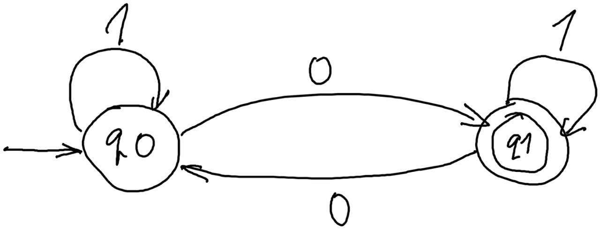


##### Hard Graph

```bash
--input test/hard_graph.png --classifier demo/classifier_weights.pth --bbox-detector demo/object_detector_weights.pth --outputs-dir-path demo/outcome --then-compile --element_arrow_distance_threshold 250
```

> [!WARNING]
> An extra node will be found, because a self arrow is recognized as a node. Anyway, you can remove it from `.d2` markup file.
> 
> Non-Maximum Suppression is useless because "Node" label has a greater score respects to "Arrow" label.

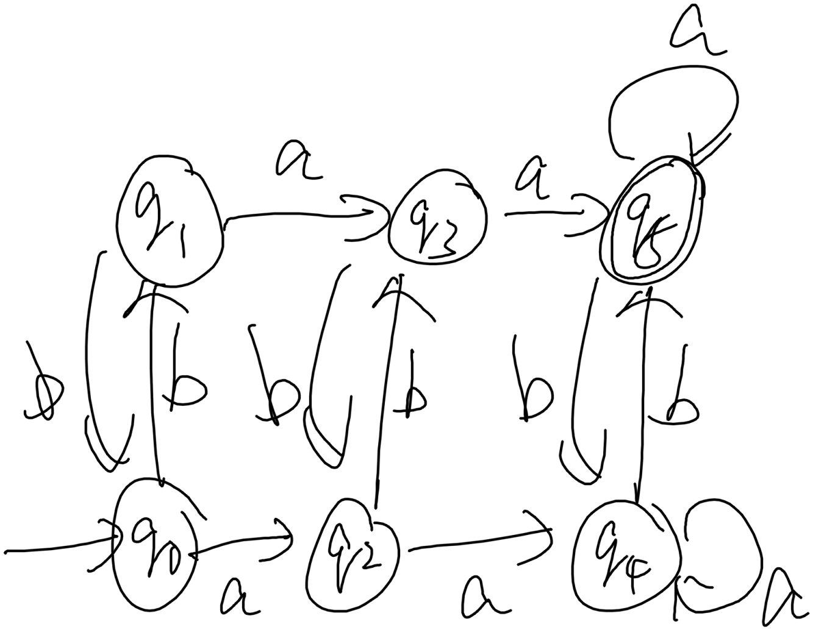

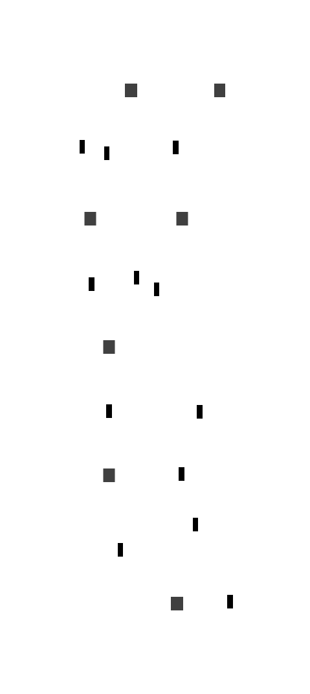


#### Flowchart

##### Easy Flowchart

```bash
--input demo/easy_graph.png --classifier demo/classifier_weights.pth --bbox-detector demo/object_detector_weights.pth --outputs-dir-path demo/outcome --then-compile --element_arrow_distance_threshold 150
```

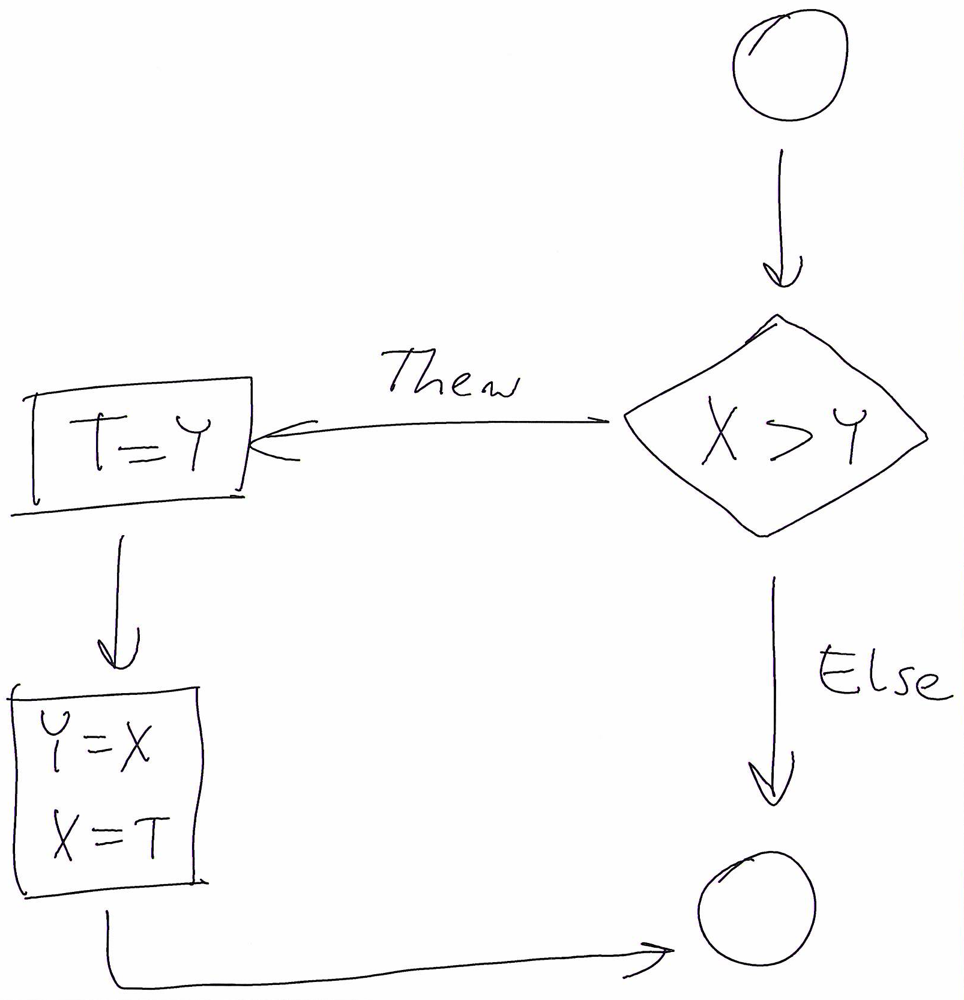


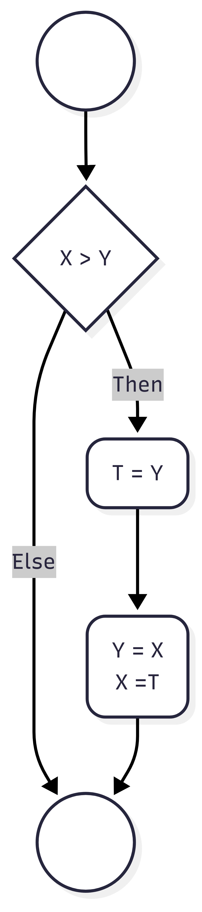

##### Hard Flowchart

```bash
--input test/hard_graph.png --classifier demo/classifier_weights.pth --bbox-detector demo/object_detector_weights.pth --outputs-dir-path demo/outcome --then-compile --element_arrow_distance_threshold 250
```

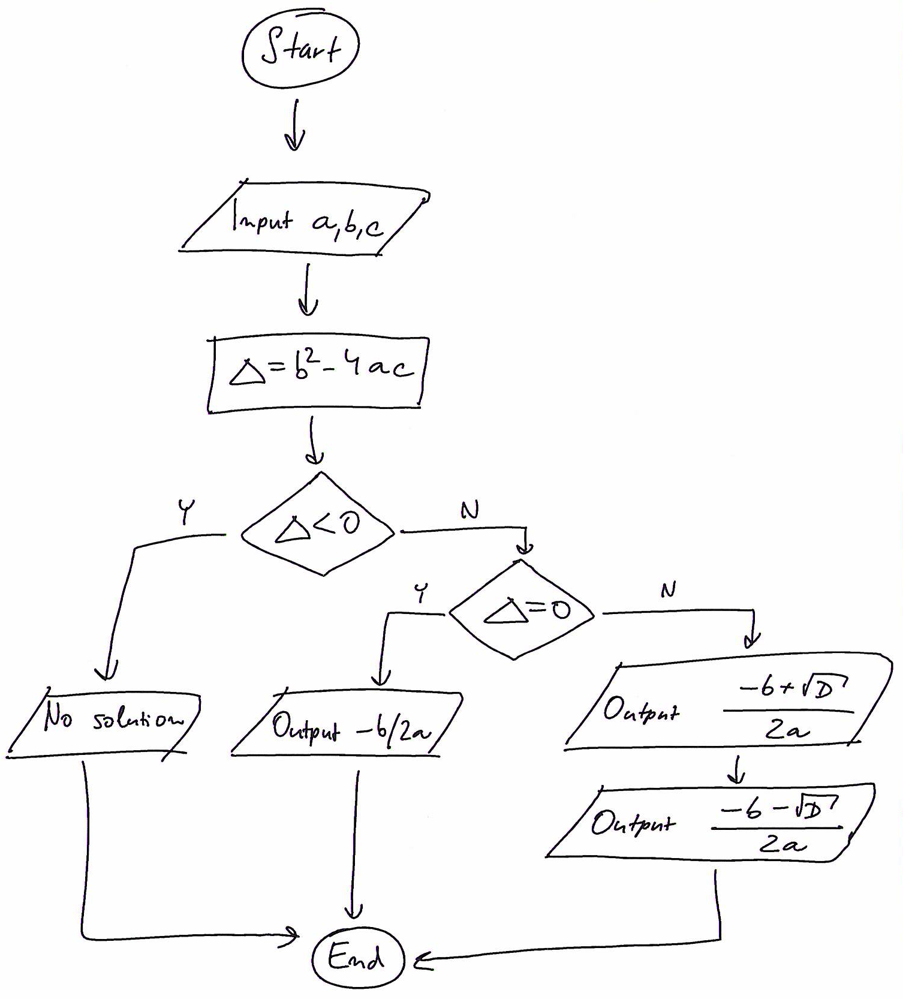

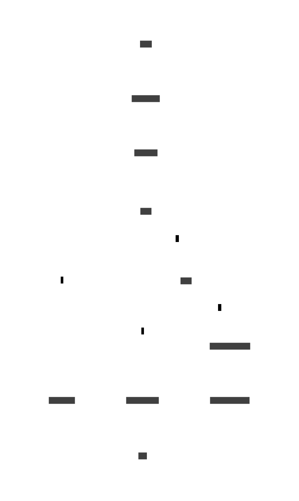

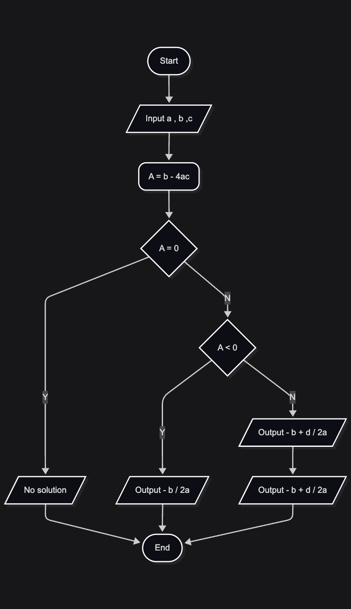


## Project Overview

Il sistema si compone di diverse parti:

- **Preprocessor**: preprocessa le immagini, e.g. raddrizza le immagini (*geometria*)
- **Classifier**: classifica i diagrammi restituendo la tipologia (e.g. `graph-diagram`, `flow-chart`)
- **Extractor**: entità astratta per *estrarre* una rappresentazione agnostica di *una specifica tipologia* di diagramma da un'immagine (e.g. matrice del grafo per i `graph-diagram`)
- **Transducer**: traduce (staticamente) i concetti agnostici in uno *specifico* linguaggio di markup di rappresentazione dei diagrammi (e.g. Mermaid)
- **Compiler**: compila il linguaggio di markup nell'effettivo diagramma
- **Orchestrator**: gestisce il flusso e i componenti

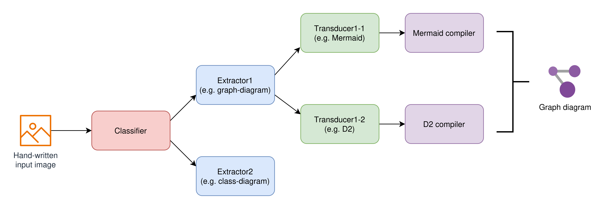

La rete classificatrice è utilizzata per individuare quale modulo estrattivo utilizzare.

Ogni extractor è **specializzato** su una sola tipologia di digramma.

Per esempio, dato come input un'immagine di un grafo:


Il classificatore produce `graph-diagram`, dunque l'orchestratore porta all'extractor per i diagrammi l'immagine di input.

L'extractor dei diagrammi produce la matrice del grafo, dove per righe e per colonne si hanno i **nodi** e i **fuori nodi** (per gestire frecce che partono dal nulla). Il valore è un interno non negativo che indica il numero di connessioni (la posizione nella matrice indica provenienza e destinazione). Inoltre, produce le datastruct di lookup per notazioni sulle frecce e testo dei nodi.

L'orchestratore porta in input dei trasduttori (in base input dell'utente oppure tutti) della relativa tipologia di diagramma, i quali produrranno le traduzioni in linguaggio di lookup.
Per esempio, in Mermaid si potrebbe avere del testo del tipo:

```
graph LR;
    q0--> q0 & q1
    q1--> q2
    q2--> q2 & q1
```

Infine, il linguaggio di markup è compilato con il relativo compilatore.


## Dataset

Source: https://github.com/bernhardschaefer/handwritten-diagram-datasets


### Graph diagram: dataset/source/fa

We used the following datasets:
- https://cmp.felk.cvut.cz/~breslmar/finite_automata/ (**graph diagrams** only, fa)
- https://cmp.felk.cvut.cz/~breslmar/flowcharts/ (**flowchart diagrams**, fcb)
- https://tc11.cvc.uab.es/datasets/OHFCD_1 (**flowchart diagrams**, fca)
- https://github.com/dwslab/hdBPMN (**BPMN diagrams**, hdBPMN)
- https://www.kaggle.com/datasets/leticiapiucco/handwritten-uml-class-diagrams (**class diagrams**)
- https://github.com/aaanthonyyy/CircuitNet (**circuit diagrams**)
- https://paperswithcode.com/dataset/ai2d (**school diagrams**)

For the classifier, we used the class, circuit and school diagrams to gain more robustness

For the extractor, we used only flowchart and graph diagrams

The diagrams are all **annotated** with **bounding box**, *also for the text*
- in addition to the provided bounding boxes for the arrows we added the bounding boxes for the head(s) and tail(s)
  - we assumed an arrow can have two heads, two tails, or one head and one tail

*Categories*

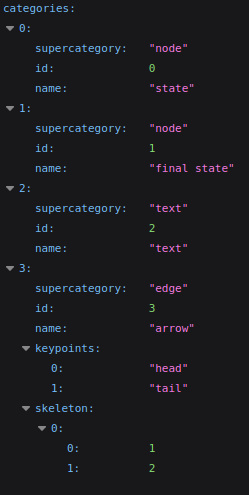

*Annotation example*

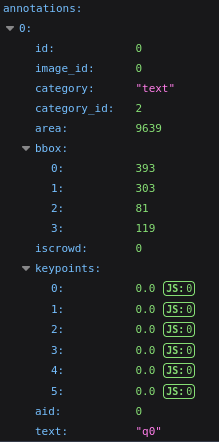
