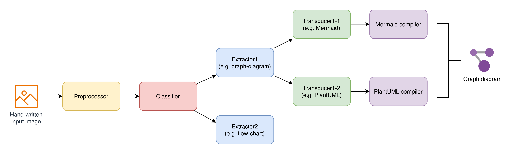
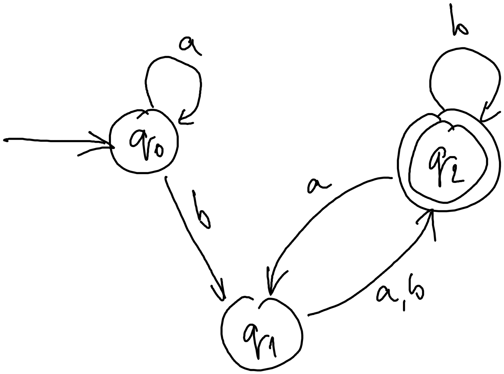
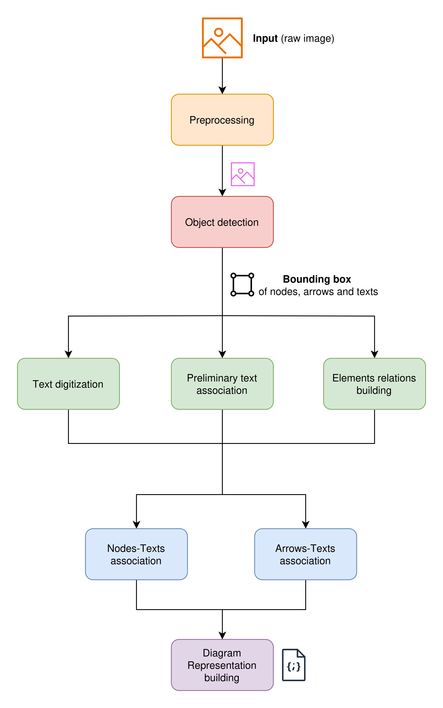
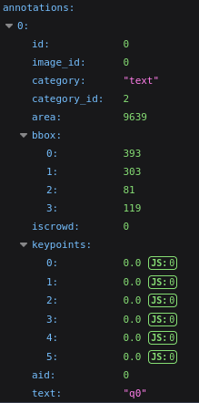

# D.I.A.G.R.A.M.: Development of Image Analysis for Graph Recognition And Modeling

This project proposes the development of a system for analyzing different types of handwritten diagrams and converting them into well-rendered images through a textual syntax.
The goal is to create a tool capable of analyzing scanned or photographed sketches of diagrams and automatically generating code that can be rendered into the same diagrams digitally, 
to eventually integrate or modify them.

## Overview idea

**Goal**: Ottenere una rappresentazione digitale di un diagramma scritto a mano.

Il sistema si compone di diverse parti:

- **Preprocessor** (no rete): preprocessa le immagini, e.g. raddrizza le immagini (*geometria*)
- **Classifier** (rete): classifica i diagrammi restituendo la tipologia (e.g. `graph-diagram`, `flow-chart`)
- **Extractor** (ibrido): entità astratta per *estrarre* una rappresentazione agnostica di *una specifica tipologia* di diagramma da un'immagine (e.g. matrice del grafo per i `graph-diagram`)
- **Transducer** (no rete): traduce (staticamente) i concetti agnostici in uno *specifico* linguaggio di markup di rappresentazione dei diagrammi (e.g. Mermaid)
- **Compiler** (no rete): compila il linguaggio di markup nell'effettivo diagramma
- **Orchestrator** (no rete): gestisce il flusso e i componenti

> [!IMPORTANT]
> *Perché non una rete (e.g. transformer) che produce subito il linguaggio di markup?* Non abbiamo i dataset e potrebbe produrre linguaggio non funzionante.



La rete classificatrice è utilizzata per individuare quale modulo estrattivo utilizzare.

Ogni extractor è **specializzato** su una sola tipologia di digramma.

Per esempio, dato come input un'immagine di un grafo:



Il classificatore produce `graph-diagram`, dunque l'orchestratore porta all'extractor per i diagrammi l'immagine di input.

L'extractor dei diagrammi produce la matrice del grafo, dove per righe e per colonne si hanno i **nodi** e i **fuori nodi** (per gestire frecce che partono dal nulla). Il valore è un interno non negativo che indica il numero di connessioni (la posizione nella matrice indica provenienza e destinazione). Inoltre, produce le datastruct di lookup per notazioni sulle frecce e testo dei nodi.

L'orchestratore porta in input dei trasduttori (in base input dell'utente oppure tutti) della relativa tipologia di diagramma, i quali produrranno le traduzioni in linguaggio di lookup.
Per esempio, in Mermaid si potrebbe avere del testo del tipo:

```
graph LR;
    q0--> q0 & q1
    q1--> q2
    q2--> q2 & q1
"""
```

Infine, il linguaggio di markup è compilato con il relativo compilatore.


## Core System Structure

### Components

#### Diagram

I diagram ID sono sempre di tipo `str` per una maggiore flessibilità, gli ID "well-known" sono listati nell'enum: `Diagram`

Usare `Diagram.DIAGRAM_TYPE.value` per ottenere l'ID stringa.

#### Classifier

`Classifier` classe astratta che rappresenta il componente classificatore.

Il metodo `classify` prende in input un oggetto `Image` e restituisce il diagram ID.

##### Image

`Image` classe che wrappa l'immagine di input.

TODO: definire gli attributi interni, probabilmente un tensore `content` con i pixel o qualcosa del genere


#### Representation

`DiagramRepresentation` classe astratta generale per le rappresentazioni dei diagrammi.

Per ogni famiglia o tipologia di diagramma si definisce una specifica rappresentazione, la quale viene prodotta dagli extractor e utilizzata dai transducer.  


#### Transducer

`Transducer` classe astratta da ereditare per costruire i propri trasduttori.

Ogni trasduttore supporta un sotto-insieme delle possibili `DiagramRepresentation`.

L'id del trasduttore è usato per configurazioni avanzate dell'orchestratore, ad esempio quando si vuole ottenere 
solo un sotto-insieme dei possibili outcome.

Per creare un nuovo trasduttore bisogna implementare due metodi:

- `compatible_diagrams` che restituisce la lista di diagram ID gestibili (usato dall'orchestratore per capire cosa può essere passato al transducer)
- `transduce` prende come input il diagram ID e la rappresentazione agnostica del diagramma; restituisce come output un `Outcome`


##### Outcome

`Outcome` classe wrapper per l'output finale di un trasduttore. L'orchestratore lo userà per ottenere il diagramma digitale (tramite compilatore).

Attualmente `Outcome` ha un solo attributo, i.e. `body`, predisposto a contenere ciò che dovrà essere passato al compilatore.

Per esempio in un transducer Mermaid:

```python
outcome.body = """
graph LR;
    A--> B & C & D
    B--> A & E
    C--> A & E
    D--> A & E
    E--> B & C & D
"""
```


#### Extractor

`Extractor` classe astratta da implementare in base al proprio estrattore.

Il metodo astratto `extract` necessita del tipo di diagramma (diagram ID) e l'immagine di input. 
Restituisce la `DiagramRepresentation` del diagramma (la quale verrà poi passata ai trasduttori compatibili).

Inoltre, è necessario specificare i diagram ID supportati, implementando il relativo metodo.

L'id dell'extractor è usato per configurazioni avanzate dell'orchestratore, ad esempio quando si hanno più estrattori 
e si vuole esplicitamente usarne solo un sotto-insieme.


## Flowchart/Graph Implementation

### Flowchart Representation

`FlowchartRepresentation` classe concreta per la rappresentazione dei diagrammi di flusso/graph diagrams.

Costituita da:

1. **Elements**: lista di elementi del diagramma (nodi e frecce), con attributi `category`, `inner_text` e `outer_text` (per il testo associato).
2. **Relations**: lista di relazioni tra gli elementi, con attributi `category`, `source_id` e `target_id` (per i nodi associati) e gli attributi che legano il testo alla relazione in base alla loro posizione relativa.


### Flowchart/Graph Extractor 



#### Preprocessing 

TODO

#### Object Detection 

TODO

#### Text digitization 

The task of getting a string from an image with handwritten text has already been solved in various ways. The main Deep Learning models
achieving this task are:

| Model | Library | Type | Size | Speed | Accuracy | Language Support | HuggingFace Hosted | Handwriting Support | Notes |
   | ------ | ------- | ------ | ------ | ------ | ------- | ------ | ------ |  ------ | ------- |
   | microsoft/trocr-small | Transformer (TrOCR) | ~100 MB | Medium | High (printed) | English (mostly) | ✅ Yes | ❌ (use -handwritten version) | Great for clean, printed text
microsoft/trocr-small-handwritten | Transformer (TrOCR) | ~100 MB | Medium | High (handwriting) | English | ✅ Yes | ✅ Yes | Optimized for handwriting
keras-io/ocr-crnn | CNN + RNN | ~30 MB | Fast | Medium-High | Latin-based only | ✅ Yes | ❌ | Lightweight, but needs TF setup
easyocr | CNN + RNN + CTC | ~60 MB | Fast | Good | 80+ languages | ❌ No (pip only) | ✅ Yes | Easiest to use, great multilingual support

In order to keep an high accuracy, we decided to employ the `microsoft/trocr-small-handwritten` model, whose weights are available on HuggingFace.

After getting a text bbox, the algorithm crops the image and passes it to the model, which returns a string.
The string is then assigned as the value to the text bbox.

#### Preliminary text association 

Preliminary text association wants to assign all text bboxes to an element or an arrow, in order to attribute it as element/arrow text in next steps.  

Therefore, all text bboxes are assigned to the _nearest_ element bbox or arrow bbox, _ignoring distance_ itself.
In other words, distance may be also huge.

Associations _pruning_ is supposed in a second moment, in order to remove improbable associations.

Algorithm follows a basic idea: iterate over text bboxes and find the nearest element/arrow bbox.

#### Elements relations building 

TODO

#### Nodes-Texts association 

Computes the relation between a text and an element based on their bboxes

Assumptions:

- there is a relation if the bboxes overlap or if their distance is lower than a certain threshold
    - the overlap is expressed as a percentage
    - the distance is taken into account only if there is no overlap
- 2 points bboxes 

Algorithm:

1. Compute the overlap between the element bbox and the text bbox
   - If there is no overlap, compute the distance between the bboxes
2. Based on the overlap (and possibly the distance) decide if there is a relation (e.g., the position of the text with respect to the element) or not
   - The overlap is expressed as a percentage and compared with a (very high) threshold 
     - If the overlap is greater than the threshold -> inner text 
     - If the overlap is lower than the threshold -> outer_text 
     - If there is no overlap and the distance is lower than a (very low) threshold -> outer_text 
     - If there is no overlap and the distance is higher than a (very low) threshold -> discarded 

Problem:

- if we switch to 4 points bboxes, the overlap (and maybe distance) computation won't work 
  - this is because the functions (written by us) for those tasks exploit the fact that 2 points bboxes are axis-aligned

Idea:

- if we switch to 4 points bboxes, change the functions for the overlap and distance computations (there are some already defined functions that can be adapted to our case)

#### Arrows-Texts association 

Computes the relation between a text and an arrow based on their bboxes

Assumptions:

- there is a relation if the bboxes overlap or if their distance is lower than a certain threshold
  - the overlap is expressed as a percentage 
  - if there is overlap, then the distance is 0
- 4 points bboxes 
- the arrow is a straight line with 0, 1 or 2 heads (e.g., there exists always a direction and it's unique)
- knowledge of the arrow's direction (e.g., where the arrow's head is/where the arrow points)
  - in case of multiple heads (or no heads at all), a random one (among the two possible for the arrow's direction) is given
  - 4 directions (`up`, `down`, `left`, `right`)

Algorithm:

1. Compute the overlap percentage and the distance between the bboxes
2. Split the arrow in three parts (SOURCE, MIDDLE, TARGET) -> MIDDLE will be greather than SOURCE and TARGET
3. Choose the part with the highest overlap (or the lowest distance) with respect to the text

Problems:

- We don't have 4 points bboxes 
- Difficult to compute 4 directions when we have slanting arrows 
- We don't know where the arrow head(s) is (are)

Ideas:

- Find a network that, given 2 points bbox of an arrow, returns its head(s) and tail(s)
  - In this case, the arrow is just a straight line connecting the head(s) and the tail(s)
  - We can build the 4 points bbox starting from head(s) and tail(s) using offsets (hyperparameters)
    - We basically move the points of a certain amount (decided by us) along x and y to "rotate" the bbox 
- Compute the direction of the arrow using 8 possibilities instead of 4
  - Divide the bbox in 9 parts and compute the overlap percentage of the arrow with each part, then return 
  a "dictionary" of {direction: overlap_percentage} couples

#### Diagram Representation building 

The _`build_elements` method is responsible for constructing a structured list of Element objects from a diagram image.

Each Element corresponds to a detected visual object (e.g., a shape, component, or region) and is associated with relevant text annotations.
This association enriches the semantic understanding of diagram elements.

Classify its relationship to the element (`INNER`, `OUTER`, or `DISCARD`) using the `_element_text_type` method.

Discarded text bounding boxes are collected but **not used** now, enabling potential future enhancements or reprocessing.

The _`build_relations` method constructs a structured list of Relation objects that describe connections between diagram elements. 
Relations are enriched with associated texts, such as labels near arrows or connectors.

`_arrow_text_type` method is used to classify the association of each text as `INNER`, `SOURCE`, `MIDDLE`, or `TARGET`.

## Dataset

Source: https://github.com/bernhardschaefer/handwritten-diagram-datasets

Ci sono tre cartelle:

- **source**: contiene i dataset presi da Internet
- **classifier**: contiene il dataset finale da usare per allenare il classificatore
- **extractor**: contiene le sotto-cartelle per le varie sotto-reti

### Graph diagram: dataset/source/fa

[dataset/source/fa](dataset/source/fa/) contiene solo **graph diagram**

Link dataset: https://cmp.felk.cvut.cz/~breslmar/finite_automata/

Ci sono 300 diagrammi disegnati da 25 persone.

I diagrammi sono tutti **annotati** con **bounding box**, *anche per il testo*.

*Categorie:*


*Esempio di annotazione*


