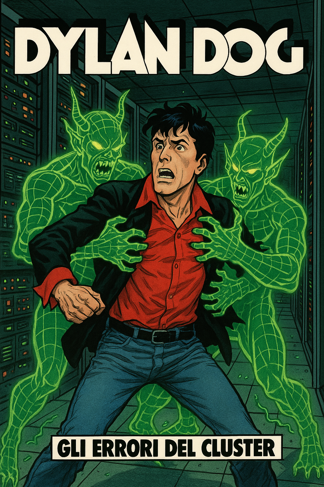

*Nota bene*: La Master's Master Guide è quella di Gibbo. Molte cose le copio da lì. A lui ogni credito, onore e benemerenza.

## Overtura

### 1) Richiedere accesso al cluster  
Apri un ticket su:  
[https://ailb-web.ing.unimore.it/tickets/](https://ailb-web.ing.unimore.it/tickets/)

### 2) Setup VPN
Io mi trovo bene con FortiClient. [Qui le istruzioni d'uso](https://www.sirs.unimore.it/site/home/servizi/accesso-vpn.html).

### 3) Accesso al cluster

Una volta attivata la VPN, puoi connetterti al cluster con un ssh:

```bash
$ ssh <aimagelab-username>@ailb-login-02.ing.unimore.it
```

*Nota*: il nome utente nostro di solito è prima lettera del nome e cognome. Es. Tu sarai snapolitano.

---

## Mediogioco

### 4) Our stuff

La nostra roba si trova in una cartella specifica - appositamente creata dal Refactor Master, mica cazzi:

```bash
$ cd /work/cvcs2025/garagnani_napolitano_ricciardi/
```

Qui dentro si trova la root del nostro progetto. Io avevo copiato solo alcune cose e sicuramente non tutto il dataset - ma forse il tuo sì. In ogni modo puoi copiare la roba che ti serve per l'allenamento in questo modo:

```bash
$ scp -r path_locale <your-aimagelab-username>@ailb-login-02.ing.unimore.it:/work/cvcs2025/garagnani_napolitano_ricciardi/dove_vuoi_mettere_la_roba
```

E' letteralmente come se fossa una mv l'scp.

*Nota*: La scp va fatta da un terminale locale della tua macchina, non su un terminale del cluster.

### 5) L'orrore virtuale

Il punto 5 sarebbe dovuto chiamarsi 666. Per ignoti motivi, io ci ho impiegato lacrime, sangue e rituali sacrificali per riuscire a creare un ambiente con Conda. In ogni modo, caccia un:

```bash
$ conda init
```

Poi riavvia la sessione. Caccia poi:

```bash
$ conda create --name <nome_env> python=3.11
$ conda activate <nome_env>
$ pip install -r requirements.txt
```

*Nota*: Non sono sicurissimo che noi avessimo detto 3.11 come versione Python. Metti quella che vuoi.

*Nota 2*: Ricopia il 'requirements.txt'. Io lo avevo messo, ma non so se sia aggiornato.

*Nota 666*: A me aveva lanciato un errore terrificante. Dopo pianti e danze della pioggia, ho notato che bastava rilanciare il comando dell'installazione (conda install etc.). Questo fenomeno è noto, nell'ambiente, come "Il Mistero Baraldo".

### 6) Lo script di allenamento - ossia, 'Penitenziagite!'

Crea il file bash che servirà poi a lanciare un file Python.

```bash
    $ nano train_extractor.sh
```

L'interno sarà più o meno:

 ```
    #!/bin/bash
    #SBATCH --job-name=training_napolitano
    #SBATCH --output=train.out
    #SBATCH --error=train.err
    #SBATCH --account=cvcs2025
    #SBATCH --partition=all_usr_prod
    #SBATCH --ntasks=1
    #SBATCH --time=1:00:00
    #SBATCH --cpus-per-task=1
    #SBATCH --gres=gpu:1
    #SBATCH --mem=16G

    module load cuda/11.8

    python3 /work/cvcs2025/garagnani_napolitano_ricciardi/.../training_script.py
```

Ovviamente modifica i parametri come meglio credi.

*Nota*: Visto che avete fatto le directory elitarie, potete tenervi tutta la spazzatura che esce dai .err e .out

*Nota 2*: Attento a come indichi i percorsi dei file nei file .py. Il codice viene eseguito da dove viene eseguito, quindi se indichi un percorso relativo, devi partire da lì.

### 7) Lancio del giavellotto

Per lanciare il job, basta eseguire:

```bash
    $ sbatch train_extractor.sh
```

---

## Epilogo

### 8) Monitoraggio del job

Magari ti interessa sapere come stanno andando le avanches del job con i cluster di AimageLab. Il comando:

```bash
squeue -u snapolitano
```

Ti fa vedere i job che hai in esecuzione, con una letterina per indicare come sono messi.

Puoi anche tenere sott'occhio i file di output e di errore che hai specificato nel file bash:

```bash
watch tail -f train.out
```

Se ad esempio stampano l'andamento del training.

Una volta fatto tutto, sempre con il comando scp, puoi copiare i risultati del training in locale e poi pusharceli che li vendiamo al Pentagono.

### 9) Note di chiusura

Quel posto è il male. Ci entrerai per necessità, ma non vedrai l'ora di uscirne. Non è un ambiente per anime sensibili, ma se vuoi fare il Master, devi passare da lì.

---

```
Così avviai il comando ssh,
nel terminale, che men loco cinghia,
e tanto più dolor, che punge e ammacca.
Stavvi Minòs orribilmente, e ringhia:
esamina i processi ne l’intrata;
giudica e manda secondo ch’avvinghia.
Dico che quando l’alma illaureata
li vien dinanzi, tutta si confessa;
e quel conoscitor de le peccata
vede qual loco d’inferno è da essa;
cingesi nei suoi batches tante volte
quantunque gradi vuol che giù sia messa.
Sempre dinanzi a lui ne stanno molte;
vanno a vicenda ciascuna al giudizio;
dicono e odono, e poi son giù volte. 
```

